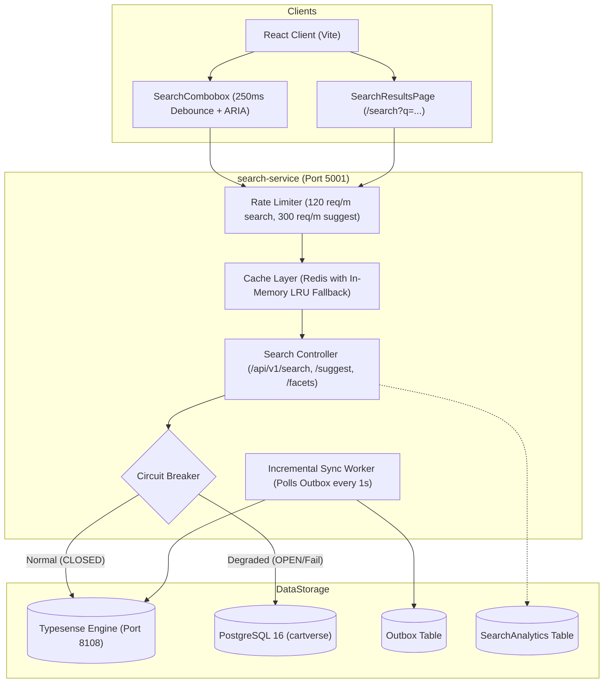

# CartVerse Search Service

Production-grade, standalone search microservice for the CartVerse PC hardware and e-commerce platform. Powered by **Typesense** with zero-downtime alias switching, transactional outbox incremental sync, Redis & LRU caching, hardware domain synonyms, model code token separators, and a resilient **PostgreSQL Circuit Breaker Fallback**.

---

## Architecture



---

## Features

1. **Hardware-Specific Relevancy & Model Codes**:
   - Punctuation token separators: `['-', '_', '/', '.', '+']` enable queries like `rtx-4070`, `rtx 4070`, and `rtx4070` to match the exact same products.
   - Domain synonym dictionaries: `gpu` <-> `graphics card` <-> `rtx` <-> `radeon`, `cpu` <-> `processor` <-> `ryzen` <-> `intel core`, `aio` <-> `liquid cooler`, etc.
   - Typo tolerance tuned for hardware specs (0 typos for 1-3 chars, 1 typo for 4-7 chars, 2 typos for 8+ chars).
   - Commercial boosting: in-stock hardware is boosted over out-of-stock items, best-sellers boosted (+5), featured boosted (+3), and ratings weighted.

2. **Zero-Downtime Indexing & Aliasing**:
   - Batched ingest into timestamped collections (`cartverse_products_YYYYMMDD_HHMMSS`).
   - Atomic collection alias swap (`cartverse_products` -> new collection) with zero dropped requests.
   - Automatic cleanup of older collections.

3. **Near Real-time Incremental Sync (<500ms)**:
   - Polling worker listens to PostgreSQL `Outbox` table.
   - Any product creation, update, deletion, or review in CartVerse core backend writes to the transactional outbox and syncs into Typesense automatically.

4. **Zero-Downtime Circuit Breaker**:
   - If Typesense is unreachable or fails 3 consecutive times, the breaker immediately trips to `OPEN`.
   - All queries and autocomplete suggestions seamlessly fall back to an optimized multi-field, tokenized SQL search with simulated facets in PostgreSQL.
   - The user never experiences a 500 error or a broken search experience.
   - Responses include `degraded: true` and `engine: "postgresql_fallback"`.

5. **Search Analytics & Zero-Result Recovery**:
   - Queries, latency, hit count, filters, and degraded state are logged to `SearchAnalytics`.
   - When 0 hits occur, the service automatically relaxes strict filters or recommends top hardware products.

---

## Quick Start

### 1. Environment Setup
Copy the sample environment variables:
```bash
cp .env.example .env
```

### 2. Install Dependencies
```bash
npm install
```

### 3. Run with Docker Compose
Start Typesense, Redis, and the Search Service together:
```bash
docker compose up -d
```

### 4. Run Standalone (Node.js)
```bash
# Start development server with file watching
npm run dev

# Run automated tests
npm test

# Run manual CLI reindexing
npm run reindex
```

---

## API Reference

### 1. Search Products
`GET /api/v1/search`

| Parameter | Type | Description |
|-----------|------|-------------|
| `q` | string | Search query string (e.g. `rtx 4070`, `ryzen 7`, `ddr5`) |
| `page` | number | Page number (default: 1) |
| `per_page` | number | Page size (default: 20, max: 100) |
| `sort_by` | string | `price-asc`, `price-desc`, `rating`, `newest`, `relevance` |
| `category` | string | Filter by category (e.g. `gpu`, `cpu`, `monitor`) |
| `brand` | string | Filter by brand (comma-separated, e.g. `ASUS,AMD`) |
| `min_price` | number | Minimum price |
| `max_price` | number | Maximum price |
| `in_stock` | boolean | Filter only in-stock items (`true`) |
| `featured` | boolean | Filter only featured items (`true`) |

### 2. Autocomplete Suggestions
`GET /api/v1/search/suggest?q=rtx`

Returns grouped suggestions:
```json
{
  "query": "rtx",
  "products": [...],
  "categories": ["gpu"],
  "brands": ["NVIDIA", "ASUS", "MSI"],
  "popular": ["RTX 4070 Super", ...]
}
```

### 3. Facet Counts
`GET /api/v1/search/facets`

Returns dynamic facet buckets with product counts for `category` and `brand`.

### 4. Health & Readiness Probes
- `GET /healthz` - Returns `{ status: "healthy" | "degraded", services: {...} }`
- `GET /readyz` - Returns `{ status: "ready", uptime: ... }`
